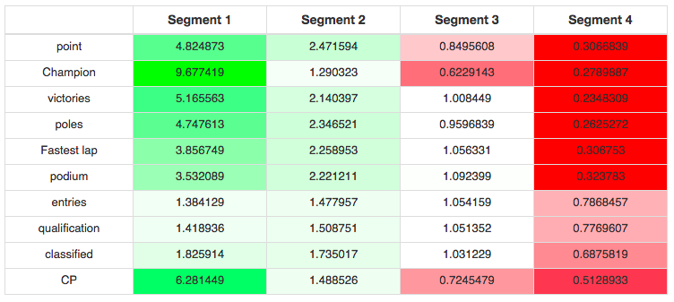

<link rel="stylesheet" href="http://netdna.bootstrapcdn.com/bootstrap/3.0.3/css/bootstrap.min.css">
<style type="text/css"> body {padding: 10px 30px 10px 30px;} table,th, td {text-align: center;} </style>
**Formula 1 Driver Report**

Peter Loftstrand
Elena Zaytseva
Xi Dou
John Holsapple


```{r include=FALSE}
## using dummy data to recreate cluster segmentation graphics
library(vegan)
require(vegan)
data(dune)
# kmeans
kclus <- kmeans(dune,centers= 4, iter.max=1000)
# distance matrix
dune_dist <- dist(dune,method=distance_used)
# Multidimensional scaling
cmd <- cmdscale(dune_dist)
```


**Business Decisions**

Our client, an F1 hedge fund, wants to chose the best drivers for the potential sponsorship. This client has historical data for 80 drivers that are widely considered the best drivers of all time. The fund wants to sponsor the potential winners of the championships, and would like to know who will appear more in the top 3 positions, so that they are shown as much as possible on TV in the branded clothes (which will promote our hedge fund to the potential clients).

**The Data**

Our data is collected from http://f1-facts.com/stats/drivers/fastest-laps. The data represents drivers from the 1950’s until today. The data can be replaced with any other set of data about drivers, which includes the same parameters as the initial one. The hedge fund can even use the data from championships for young drivers in order to chose the best one for sponsoring in the future.

The data set includes the following parameters:

1-  Points- The number of points earned in F1 race

2-	Championships- The number of F1 championships

3-	Victories- The number of wins

4-	Poles- Start the race in first, because of qualification time

5-	Fastest Lap- The fastest lap in a race

6-	Podium- One of top three racers

7-	Entries- Number of attempted match entries

8-	Qualifications- Number of matches qualified for

9-	Classified- Points earned in incomplete races

10-	CP- Comparsion points determined by:

Qualified better/worse than team-mate(s): +1/-1

Classified better/worse than team-mate(s): +2/-2

Better/slower fastest lap than team-mate(s): +1/-1


The full information for  `r min(max_data_report, nrow(ProjectData))`  drivers is presented in the table below: 

```{r echo=FALSE, message=FALSE, prompt=FALSE, results='asis'}
# let's make the data into data.matrix classes so that we can easier visualize them
ProjectDataFactor = data.matrix(ProjectDataFactor)
ProjectData = data.matrix(ProjectData)
```


<br>

<div class="row">
<div class="col-md-6">
```{r echo=FALSE, message=FALSE, prompt=FALSE, results='asis'}
show_data = data.frame(round(ProjectDataFactor,2))
show_data = show_data[1:min(max_data_report,nrow(show_data)),]
row<-rownames(show_data)
dfnew<-cbind(row,show_data)
change<-colnames(dfnew)
change[1]<-"Variables"
colnames (dfnew)<-change
m1<-gvisTable(dfnew,options=list(showRowNumber=TRUE,width=1220, height=min(400,27*(nrow(show_data)+1)),allowHTML=TRUE,page='disable'))
print(m1,'chart')
```
</div>
</div>
<br> <br>
As the data is shown on different scales, we’ve brought it to the one scale version


<div class="row">
<div class="col-md-6">
```{r echo=FALSE, comment=NA, warning=FALSE, message=FALSE,results='asis'}
show_data = data.frame(round(my_summary(ProjectDataFactor),2))
#show_data = show_data[1:min(max_data_report,nrow(show_data)),]
row<-rownames(show_data)
dfnew<-cbind(row,show_data)
change<-colnames(dfnew)
change[1]<-"Variables"
colnames (dfnew)<-change
m1<-gvisTable(dfnew,options=list(showRowNumber=TRUE,width=1220, height=min(400,27*(nrow(show_data)+1)),allowHTML=TRUE,page='disable'))
print(m1,'chart')
```
</div>
</div>


After the data is normalized we run through all of the steps of the segmentation analysis, which will not be described here to avoid the confusion and pick up only the most important ones.


```{r echo=FALSE, comment=NA, warning=FALSE, message=FALSE, fig.align='center', results='asis'}
Hierarchical_Cluster_distances <- dist(ProjectData_segment, method=distance_used)
Hierarchical_Cluster <- hclust(Hierarchical_Cluster_distances, method=hclust_method)
# Display dendogram
plot(Hierarchical_Cluster, main = NULL, sub=NULL, labels = 1:nrow(ProjectData_segment), xlab="Our Observations", cex.lab=1, cex.axis=1) 
# Draw dendogram with red borders around the 3 clusters
rect.hclust(Hierarchical_Cluster, k=numb_clusters_used, border="red") 
```


```{r include=FALSE}
## using dummy data to recreate cluster segmentation graphics
library(vegan)
require(vegan)
data(dune)
# kmeans
kclus <- kmeans(dune,centers= 4, iter.max=1000)
# distance matrix
dune_dist <- dist(dune,method=distance_used)
# Multidimensional scaling
cmd <- cmdscale(dune_dist)
```

```{r Fig3, fig.width=6, fig.height=6, message=FALSE, echo=FALSE, fig.align='center', warning=FALSE, fig=TRUE}
# plot MDS, with colors by groups from kmeans
groups <- levels(factor(kclus$cluster))
ordiplot(cmd, type = "n")
cols <- c("steelblue", "darkred", "darkgreen", "pink")
for(i in seq_along(groups)){
  points(cmd[factor(kclus$cluster) == groups[i], ], col = cols[i], pch = 16)
  }

# add spider and hull
ordispider(cmd, factor(kclus$cluster), label = TRUE)
ordihull(cmd, factor(kclus$cluster), lty = "dotted")
```


After running the clustering and segmentation analysis we came to the conclusion, that we can easily identify 4 segments, in which the drivers can fall. Those segments are visible from the below indicators, which show the potential for each of the segments to contain winning drivers:



The chosen segments are described as per below:

**Segment 1- “The Winners”**

The racers that fall into this segment have the highest probability of winning a championship.

**Segment 2- “The Not Losers”**

The racers that fall into this segment have a low chance of winning a championship, but have/had some probability of moving into the first segment.

**Segment 3- “Losers”**

The racers that fall into this segment have quite a low chance of winning a championship.


**Segment 4- “Go to NASCAR”**

The racers that fall into this segment are not winners and should try racing in a box-car-derby.


We advise our client that drivers that fall into the first segment are more likely to win a championship; therefore, a better target for F1 hedge fund investment would more closely reflect the racers in this segment. Racers in segment three and four are not promising candidates for investment, because they have a low probability of winning a potential F1 race.


After running the clustering and segmentation analysis we came to the conclusion, that we can easily identify 4 segments, in which the drivers can fall. Those segments are visible from the below graph: 

<div class="row">
<div class="col-md-6">
```{r echo=FALSE, message=FALSE, prompt=FALSE, results='asis'}
numb_clusters_used = 5

cluster_file = paste(paste(local_directory,"data", sep="/"),paste(paste(datafile_name,paste("cluster",numb_clusters_used,sep="") , sep="_"), "csv", sep="."), sep="/")

cluster_ids <- read.csv(cluster_file, sep=",", dec=".") # this contains only the matrix ProjectData
cluster_ids <- data.matrix(cluster_ids)
cluster_ids = cluster_ids[,2]

cluster_size = NULL
for (i in sort(unique(cluster_ids))){
  cluster_size = c(cluster_size,sum(cluster_ids == i))
  }
cluster_size = matrix(cluster_size, nrow=1)
colnames(cluster_size) <- paste("Segment", 1:length(cluster_size), sep=" ")
rownames(cluster_size) <- "Number of Obs."
print(xtable(cluster_size ,caption="Number of Observations per segment in the Dataset", digits=1,),type="html",html.table.attributes = "class='table table-striped table-hover table-bordered'",caption.placement="top",comment = FALSE,include.rownames = TRUE)
```
</div>
</div>

<br>

We advise our client that drivers that fall into the first segment are more likely to win a championship; therefore, a better target for F1 hedge fund sponsorship would more closely reflect the racers in this segment. Racers in segment three and four are not promising candidates for investment, because they have a low probability of winning a potential F1 championship.
<br><br>
<blockquote> <p>
Dear Hedge Fund, we are happy to announce that you have decided to sponsor the next year's most probable F1 champion! Please proceed with payment of gazillion dollars.
</p> </blockquote>


